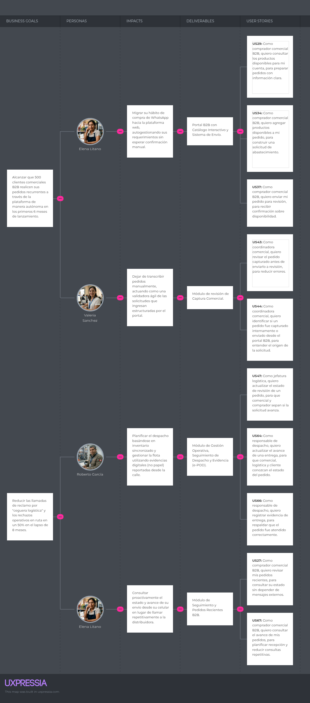

## 3.2. Impact Mapping

El Impact Mapping de Nexa permite conectar los objetivos de negocio del producto con los actores que influyen en dichos objetivos, los cambios de comportamiento esperados y los entregables funcionales que permiten producir esos impactos. Esta sección funciona como puente entre los hallazgos del proceso de Requirements Elicitation & Analysis y la priorización posterior del Product Backlog.

El mapa fue elaborado considerando los User Personas definidos para el proyecto y se organiza en cinco columnas principales: Business Goals, Personas, Impacts, Deliverables y User Stories. Esta estructura permite visualizar cómo cada historia contribuye a un objetivo de negocio y evita que el backlog se construya como una lista aislada de funcionalidades.

Para mantener coherencia con la actualización del proyecto, los User Personas del mapa se interpretan dentro de los tres segmentos definitivos de Nexa:

1. **S1: Commercial Coordination**, representado por Valeria Sánchez, responsable de validar solicitudes, revisar pedidos capturados y coordinar la atención comercial.
2. **S2: Operations / Account Owner**, representado por Roberto García, responsable de inventario, revisión operativa, despacho, trazabilidad y administración de la operación.
3. **S3: B2B Buyer Portal**, representado por Elena Litano, compradora comercial externa que consulta catálogo, arma solicitudes, revisa pedidos y da seguimiento a la atención recibida.

El primer Business Goal busca que 500 clientes comerciales B2B realicen pedidos recurrentes a través de Nexa de manera autónoma durante los primeros 6 meses de lanzamiento. Este objetivo se relaciona principalmente con S3 y S1, ya que busca reducir la dependencia de canales dispersos como WhatsApp, llamadas o registros manuales. Para S3, el impacto esperado es migrar el hábito de compra hacia una plataforma web con catálogo y envío estructurado de pedidos. Para S1, el impacto esperado es dejar de transcribir pedidos manualmente y revisar solicitudes estructuradas con menor riesgo de error.

El segundo Business Goal busca reducir en 50% las llamadas de reclamo por “ceguera logística” y los rechazos operativos en ruta durante los primeros 8 meses. Este objetivo se relaciona principalmente con S2 y S3. Para S2, el impacto esperado es planificar el despacho con información sincronizada, estados actualizados y evidencias digitales de entrega. Para S3, el impacto esperado es consultar proactivamente el estado del pedido desde el portal, reduciendo consultas repetitivas a la distribuidora.

*Impact Mapping de Nexa — Relación entre objetivos de negocio, personas, impactos, entregables y User Stories*

La lectura central del Impact Mapping es que Nexa no busca comportarse como un ERP completo desde su primera versión. El MVP se concentra en mejorar la continuidad del flujo comercial-operativo: consulta de catálogo, solicitud del comprador, revisión comercial, revisión operativa, despacho y seguimiento. Por ello, los impactos esperados se relacionan con tres mejoras concretas: menor tiempo de registro, menor riesgo de errores operativos asociados a disponibilidad o despacho, y mayor visibilidad del pedido.

Desde la lógica del informe, el Impact Mapping sirve como base para justificar el Product Backlog. Las User Stories priorizadas en la sección 3.3 deben responder a los impactos representados en el mapa, evitando priorizar funcionalidades aisladas que no contribuyan directamente al flujo principal de Nexa.
