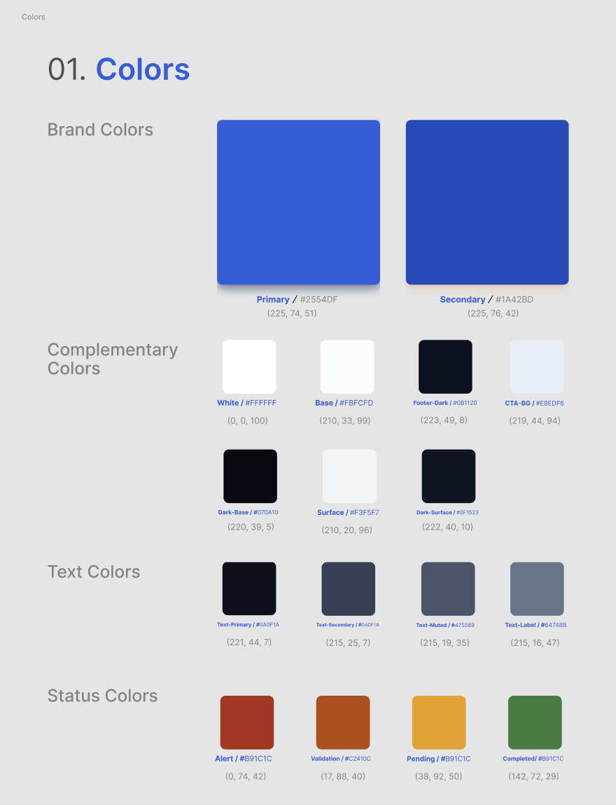
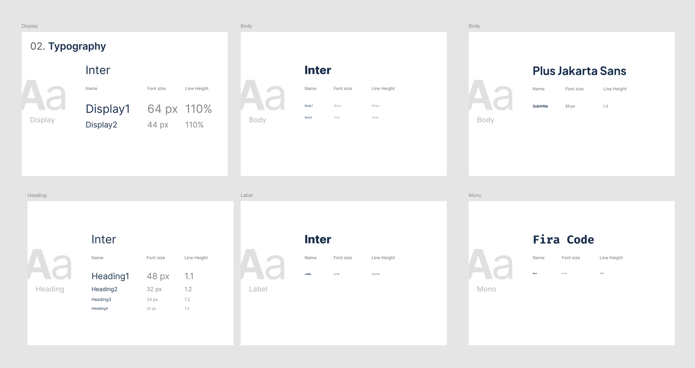
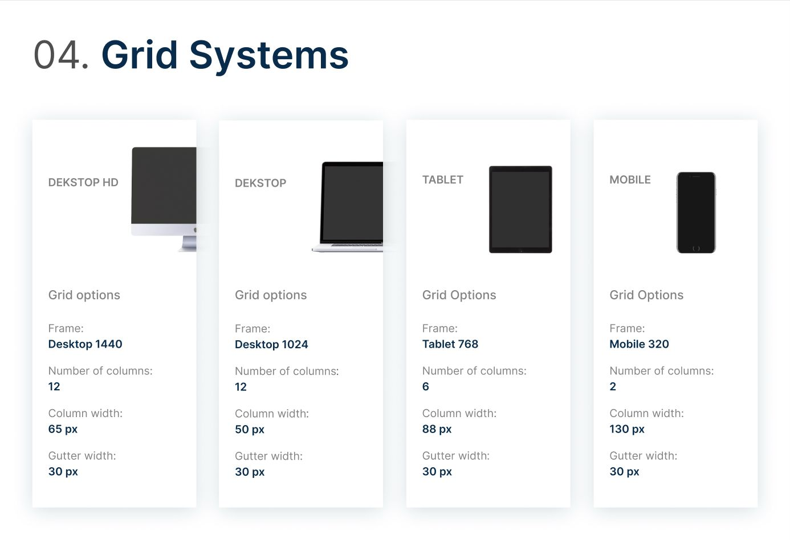
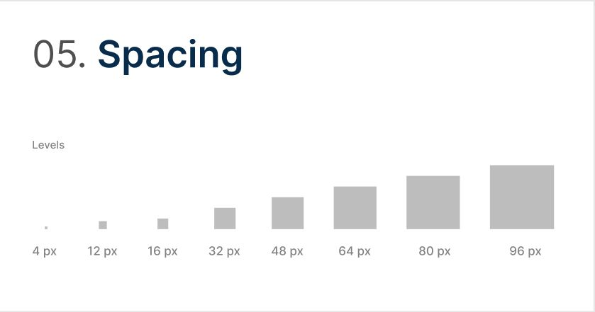

# Capítulo IV: Product Design

El Capítulo IV representa la transición desde la fase de descubrimiento hacia la materialización visual y arquitectónica de la plataforma. En esta sección se documentan los criterios estéticos, las estructuras de información y las decisiones de diseño que permiten transformar los Bounded Contexts identificados en el dominio en una solución digital coherente.

Nexa se construye como un ecosistema de tres superficies complementarias: una landing page pública, una aplicación web interna y un portal B2B para compradores comerciales. Cada superficie comparte un lenguaje visual común, pero adapta su densidad, navegación y tono de interacción según el contexto de uso de los segmentos definitivos: S1 Commercial Coordination, S2 Operations / Account Owner y S3 B2B Buyer Portal.

---

## 4.1. Style Guidelines

El sistema visual de Nexa se organiza mediante design tokens, criterios tipográficos, patrones de interacción y assets reutilizables. Estos lineamientos funcionan como una fuente común de diseño para el equipo, aunque su implementación técnica se distribuye según la superficie:

- En la **Landing Page**, los tokens se implementan mediante archivos CSS organizados por responsabilidades visuales: tokens, typography, layout, buttons, patterns y components.
- En la **Web Application**, los tokens se implementan como variables CSS consumidas por componentes Vue 3, PrimeVue, PrimeFlex y estilos propios.
- En futuras integraciones, el backend planificado no debe redefinir criterios visuales, sino exponer datos y reglas de negocio que la Web Application represente con los mismos patrones de interfaz.

La arquitectura visual facilita:

- Mantener consistencia de marca entre Landing Page y Web Application.
- Adaptar densidad y componentes según el tipo de usuario: S1, S2 o S3.
- Reducir contradicciones visuales entre mockups, prototipos e implementación.
- Escalar hacia nuevos módulos sin redefinir colores, tipografías o patrones base.
- Documentar criterios de accesibilidad y responsive design desde el diseño.

#### Color Palette

La paleta de Nexa se organiza en cinco grupos funcionales: marca primaria, superficies, texto, estados semánticos y acentos de interacción. La familia azul representa confianza, control y trazabilidad; los neutros cálidos reducen fricción visual en pantallas densas; y los colores semánticos comunican estados operativos críticos.

*Sistema de Colorimetría Nexa*

> *Nota:* Especificación de Brand Colors, Text Colors y Status Colors. Elaboración propia.

| Grupo | Token / referencia visual | Propósito | Uso en Landing Page | Uso en Web Application |
|---|---|---|---|---|
| Primary Blue | `#2563EB` / familia azul Nexa | Marca, CTAs, enlaces activos y acciones principales | Botones principales, enlaces destacados, acentos de sección | Acciones primarias, estados activos, navegación, filtros seleccionados |
| Primary Hover / Dark Blue | `#1D4ED8` / tonos oscuros de marca | Jerarquía, hover, headers oscuros y contraste | Navbar, footer, hover de CTA | Sidebar, topbar, foco activo, estados de navegación |
| Warm Off-White | `#F9F7F4` / base cálida | Fondo general y descanso visual | Background de secciones claras | Fondo de workspace y paneles secundarios |
| Surface White | `#FFFFFF` | Contenedores, cards y formularios | Cards de beneficios, cards de flujo, bloques de contenido | Cards de métricas, formularios, tablas y paneles de detalle |
| Neutral Grey | Escala `#E5E7EB` a `#111827` | Bordes, labels, texto secundario y jerarquía textual | Subtítulos, separadores, textos descriptivos | Labels, bordes de tabla, metadata, estados inactivos |
| Success | `#22C55E` / `#16A34A` | Confirmación y operación estable | Indicadores de disponibilidad o confianza | Stock disponible, pedido confirmado, entrega completada |
| Warning | `#F59E0B` | Atención o riesgo moderado | Mensajes preventivos si aplica | Crédito limitado, lote próximo a vencer, validación pendiente |
| Danger | `#EF4444` / `#DC2626` | Error, bloqueo o riesgo crítico | Mensajes de error en formularios | Stock agotado, validación fallida, incidencia de temperatura |
| Info | `#2563EB` | Información neutral o progreso | Enlaces informativos y mensajes de soporte | Pedido en tránsito, tracking, estado informativo |

La diferencia principal entre superficies no está en la identidad cromática, sino en su frecuencia y densidad de uso. La Landing Page emplea principalmente la familia primaria, superficies claras y contrastes editoriales; la Web Application incorpora con mayor frecuencia estados semánticos para comunicar condiciones operativas de pedidos, inventario, despacho y documentos.

> *Nota de consistencia visual:* la tabla anterior debe considerarse la referencia textual de los tokens implementados. Las láminas visuales de colores deben mantenerse actualizadas con estos valores para evitar contradicciones entre reporte, prototipo e implementación.

---

#### Typography

Nexa utiliza una combinación tipográfica orientada a claridad, jerarquía visual y lectura rápida de información operativa. La Landing Page usa mayor escala y peso visual para comunicar valor; la Web Application utiliza tamaños más compactos para soportar tablas, formularios, estados y dashboards.

*Sistema Tipográfico Nexa*

> *Nota:* Definición de jerarquías para Display, Headings, Body y Mono. Elaboración propia.

| Nivel | Familia principal | Uso en Landing Page | Uso en Web Application |
|---|---|---|---|
| Display / Hero | Plus Jakarta Sans / Inter fallback | Títulos hero, titulares de alto impacto y mensajes de conversión | No aplica como patrón dominante |
| Heading | Plus Jakarta Sans / Inter fallback | Títulos de sección, bloques de propuesta de valor | Títulos de módulo, encabezados de páginas y cards |
| Body | Inter | Párrafos, descripciones, FAQ y textos editoriales | Labels, contenido de tabla, formularios, descripciones y mensajes de ayuda |
| Label / Caption | Inter | Microcopy de CTA, etiquetas de sección y textos secundarios | Badges, metadata, estados, filtros y mensajes de validación |
| Mono / Technical | JetBrains Mono / Fira Code fallback | Códigos o referencias puntuales si aplica | SKUs, códigos de lote, timestamps, identificadores de pedido y referencias técnicas |

La jerarquía tipográfica se adapta al contexto de uso:

- La **Landing Page** prioriza impacto visual con títulos grandes, espaciado amplio y secciones de baja densidad.
- La **Web Application** prioriza legibilidad funcional con headings entre 18px y 32px, body entre 13px y 16px, captions de 12px y uso monoespaciado solo para datos técnicos.
- Los textos operativos deben evitar frases ambiguas. En S1, el lenguaje debe orientar validación y conversión; en S2, debe orientar control y ejecución; en S3, debe orientar consulta, solicitud y seguimiento.

---

### 4.1.2. Web Style Guidelines

#### Components and UI Patterns

El sistema de componentes de Nexa se construye sobre patrones reutilizables que varían en escala, densidad y prioridad según el tipo de usuario. La Landing Page comunica valor y guía a la acción; la Web Application permite completar tareas operativas con rapidez y trazabilidad.

*Botones y Componentes Nexa*

> *Nota:* Variantes de botones primarios, secundarios y estados. Elaboración propia.

#### Patrones compartidos

| Patrón | Comportamiento común | Propósito |
|---|---|---|
| Botón primario | Fondo azul primario, texto blanco, hover oscuro y foco visible | Ejecutar la acción principal del contexto |
| Botón secundario | Fondo claro o transparente, borde visible y texto de alto contraste | Ofrecer acciones alternativas sin competir con la principal |
| Cards / Surfaces | Fondo blanco, border-radius consistente, sombra sutil y separación clara | Agrupar información relacionada |
| Form fields | Borde neutro, label visible, placeholder breve y focus ring azul | Reducir errores de entrada y orientar la captura de datos |
| Status badges | Color semántico + texto corto y contrastado | Comunicar estado sin depender solo del color |
| Tables | Cabeceras claras, filas densas, acciones por fila y filtros | Revisar información operativa de alto volumen |
| Drawers / Modals | Contenido contextual sin abandonar el flujo principal | Ver detalle, editar o confirmar acciones |
| Empty states | Mensaje breve + siguiente acción sugerida | Orientar al usuario cuando no hay datos cargados |
| Alerts | Título, explicación y acción recomendada | Comunicar bloqueos, advertencias o confirmaciones |

#### Variaciones por superficie

| Componente | Landing Page | Web Application |
|---|---|---|
| CTA principal | Botón alto, texto comercial y orientación a demostración o acceso | Botón compacto con acción operativa específica |
| Cards | Comunican beneficios, dolores, soluciones y cobertura del sistema | Muestran métricas, entidades, estados y resúmenes de operación |
| Navegación | Navbar horizontal con secciones de contenido y acceso a plataforma | Sidebar o navegación por módulos de negocio |
| Tablas | No son componente principal | Componente central para pedidos, clientes, inventario y dispatch orders |
| Formularios | Formularios de contacto o solicitud | Captura y validación de solicitudes, clientes, documentos y configuración |
| Drawers / Modals | Uso limitado o no dominante | Detalle de entidad, edición rápida y confirmación de acciones |
| Badges / Estados | Uso moderado para reforzar mensajes de confianza | Uso frecuente para estados de pedido, stock, documentos, temperatura y despacho |

#### Variaciones por segmento

| Segmento | Necesidad de interfaz | Patrones prioritarios |
|---|---|---|
| S1: Commercial Coordination | Validar solicitudes, revisar clientes, convertir requests en purchase orders y coordinar documentos | Tablas de solicitudes, filtros por estado, formularios de validación, badges comerciales, drawers de detalle |
| S2: Operations / Account Owner | Controlar inventario, lotes, FEFO, dispatch orders, POD, accesos y configuración de empresa | Dashboards operativos, tablas densas, cards de stock, estados de despacho, formularios de administración, alertas |
| S3: B2B Buyer Portal | Consultar catálogo, crear solicitudes, revisar pedidos, acceder a documentos y seguir tracking | Cards de catálogo, request builder, timeline de tracking, documentos visibles, estados simples y mensajes de confirmación |

---

#### Responsive and Surface Adaptation

El sistema de diseño opera sobre una rejilla flexible con breakpoints para Desktop HD, Desktop, Tablet y Mobile. La adaptación responsive no debe entenderse como duplicación de pantallas, sino como reorganización progresiva de contenido y controles.

*Sistema de Rejilla y Breakpoints*

> *Nota:* Dimensionamiento para Desktop HD, Desktop y Tablet. Elaboración propia.

*Escala de Espaciado*

Escala basada en múltiplos de 4px, desde 4px hasta 96px. Elaboración propia.

**Comportamiento responsive por superficie:**

- **Landing Page:** responsive completo, con navegación adaptable, hero fluido, secciones que pasan de multi-columna a stack vertical y CTAs visibles en dispositivos móviles.
- **Web Application para S1 y S2:** diseñada principalmente para desktop y tablet por su densidad operativa. En pantallas pequeñas, la navegación debe colapsar y las tablas deben usar scroll horizontal o vistas compactas.
- **Buyer Portal para S3:** debe priorizar tablet y mobile, porque el comprador puede consultar catálogo, solicitudes y tracking desde dispositivos menos especializados.

Los componentes interactivos deben respetar una altura mínima aproximada de 44px en superficies táctiles. Esta decisión busca mejorar usabilidad en contextos operativos donde los usuarios pueden interactuar rápidamente, desde almacén, ruta o entorno de atención comercial.

---

#### Iconography

El sistema iconográfico utiliza trazos lineales, formas simples y consistencia de grosor para mantener una interfaz ligera. Los iconos deben apoyar la comprensión del módulo, no reemplazar labels textuales.

*Iconografía Nexa*

> *Nota:* Biblioteca de iconos vectoriales para navegación y soporte. Elaboración propia.

| Uso | Criterio |
|---|---|
| Navegación | Icono + label textual para reducir ambigüedad |
| Estados | Icono opcional acompañado de badge o texto |
| Acciones | Iconos reconocibles para editar, ver detalle, filtrar, descargar o confirmar |
| Operación | Iconos asociados a pedidos, inventario, despacho, documentos y tracking |
| Accesibilidad | No depender únicamente del icono para comunicar significado |

En la Web Application, los iconos pueden apoyarse en PrimeIcons y en SVGs propios. En la Landing Page, los iconos deben mantener el estilo lineal y no competir con los textos de propuesta de valor.

---

#### Accessibility

Los lineamientos de accesibilidad de Nexa se orientan al estándar **WCAG 2.1 AA**. Debido a que una auditoría formal de accesibilidad debe ejecutarse sobre la versión implementada y desplegada, esta sección documenta los criterios incorporados en el diseño y deja su verificación final como parte de las evidencias posteriores de implementación y validación.

| Criterio WCAG | Implementación | Estado |
|---|---|---|
| 1.4.3 Contrast (Minimum) | Textos principales con contraste suficiente sobre fondos claros y oscuros | Pass |
| 2.1.1 Keyboard Accessible | Navegación por teclado en enlaces, botones, formularios y controles principales | Pass |
| 2.4.4 Link Purpose | Labels y textos de enlace comprensibles sin depender solo del contexto visual | Pass |
| 1.4.11 Non-text Contrast | Bordes, focus rings, estados y controles visibles con contraste adecuado | Pass |
| 3.3.1 Error Identification | Mensajes de error claros en formularios y validaciones | Pass |
| 3.3.2 Labels or Instructions | Campos con labels visibles, instrucciones breves y placeholders no críticos | Pass |

Los estados críticos no deben comunicarse únicamente mediante color. Cada badge, alerta o validación debe incluir texto breve, por ejemplo: `Confirmed`, `Pending validation`, `Out of stock`, `In transit`, `Delivered` o `Document pending`, según corresponda al flujo de negocio.
