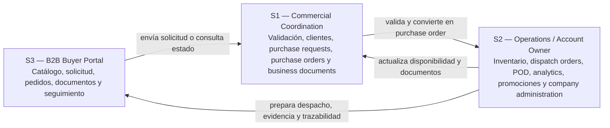
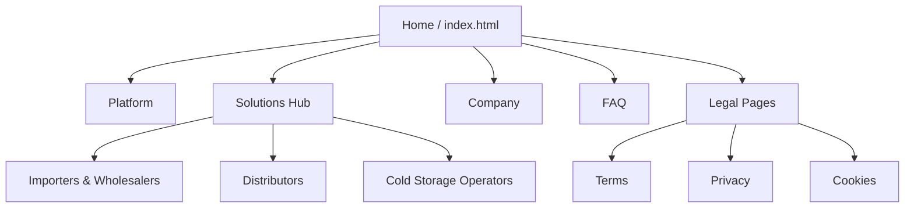
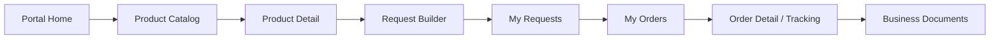

## 4.2. Information Architecture

La arquitectura de información de Nexa organiza el contenido y los flujos de interacción alrededor de tres superficies complementarias: el sitio público o Landing Page, la Web Application interna y el Buyer Portal. Esta organización responde al modelo SaaS B2B del producto: una empresa importadora o distribuidora de cadena de frío contrata Nexa y habilita usuarios internos y externos dentro de un mismo ecosistema operacional.

Para mantener consistencia con los segmentos definitivos del proyecto, la información no se organiza únicamente por pantallas, sino por responsabilidades de negocio. **S1 — Commercial Coordination** utiliza la consola interna para recibir solicitudes, validar clientes, revisar condiciones comerciales, convertir solicitudes en órdenes de compra y gestionar documentos. **S2 — Operations / Account Owner** utiliza la consola interna para controlar inventario, lotes, despacho, evidencias, promociones, portales externos y administración de la empresa contratante. **S3 — B2B Buyer Portal** utiliza el portal para consultar catálogo, construir solicitudes, revisar pedidos, acceder a documentos y seguir el estado de entrega.

No se crea un segmento administrativo independiente. Las tareas de configuración, accesos, tenant, empresa y suscripción forman parte de **S2 — Operations / Account Owner**.

### 4.2.1. Organization Systems

#### Landing Page — Organización jerárquica con apoyo matricial

El sitio público presenta una arquitectura jerárquica de dos niveles. El punto de entrada es la página principal, desde la cual el visitante accede a las áreas troncales **Platform**, **Solutions**, **Company** y **FAQ**. Dentro de **Solutions**, la navegación se orienta por tipo de operador de cadena de frío: **Importers & Wholesalers**, **Distributors** y **Cold Storage Operators**.

Estas páginas de Solutions no sustituyen a los segmentos S1, S2 y S3. Funcionan como páginas comerciales para explicar la propuesta de valor a empresas potencialmente contratantes, mientras que S1, S2 y S3 representan perfiles de uso dentro del ecosistema operacional de Nexa.

La profundidad máxima de navegación comercial es de dos niveles (`Home > Solutions > Distributors`), lo que favorece rapidez de acceso y reduce carga cognitiva. Las páginas legales se ubican como soporte desde el footer y no forman parte del flujo principal de conversión. Las llamadas a la acción conectan el descubrimiento del producto con la solicitud de demostración o el ingreso a la Web Application.

#### Web Application interna — Organización funcional por capacidades de negocio

La Web Application interna se organiza mediante un sidebar persistente y rutas agrupadas por responsabilidad de negocio. Esta estructura permite que S1 y S2 trabajen sobre el mismo tenant sin mezclar sus responsabilidades principales.

| Segmento | Grupo funcional | Módulos principales | Propósito |
|---|---|---|---|
| S1 — Commercial Coordination | Commercial | Commercial Dashboard, Product Catalog, Purchase Requests, Purchase Orders, Manual Order Entry, B2B Clients, Business Documents | Recibir, validar, convertir y documentar pedidos B2B |
| S2 — Operations / Account Owner | Operations | Operations Dashboard, Inventory Control, Inventory Lots, Dispatch Orders, Proof of Delivery, Operational Analytics, Business Documents, Promotions, Customer Portals, Company Administration | Controlar inventario, despacho, evidencias, operación, cuenta y configuración de empresa |
| S1 / S2 | Shared account area | Profile | Mantener información del usuario autenticado dentro del tenant |

La separación por grupos no implica aplicaciones distintas. Ambos segmentos internos utilizan la misma consola, pero la navegación se filtra según rol, responsabilidad y scope operativo.

#### Buyer Portal — Organización transaccional orientada al comprador

El Buyer Portal se organiza alrededor del flujo de abastecimiento de S3. La estructura prioriza la autonomía del comprador para consultar productos, armar una solicitud, revisar su historial, acceder a documentos y seguir el estado de sus pedidos.

| Etapa | Módulo del portal | Propósito para S3 |
|---|---|---|
| Descubrimiento | Home, Product Catalog, Premium | Revisar productos disponibles, promociones y catálogo visible |
| Solicitud | Request Builder, My Requests | Construir y consultar solicitudes enviadas |
| Pedido confirmado | My Orders | Revisar órdenes de compra y estado operativo |
| Documentación | Business Documents | Consultar documentos visibles asociados al pedido |
| Cuenta | Profile | Revisar datos de comprador y relación con la empresa contratante |

#### Route Architecture and Navigation Storytelling

La Web Application utiliza Vue Router con hash history para mantener compatibilidad con despliegues estáticos y evitar problemas de rewrite en rutas. Las rutas principales se agrupan por experiencia y capacidad de negocio, no por pantallas aisladas.

| Superficie | Ruta principal | Segmento | Significado | Propósito |
|---|---|---|---|---|
| Auth | `/auth/login` | S1, S2, S3 | Acceso autenticado | Entrada al sistema y selección de experiencia según scope |
| Auth | `/auth/recover` | S1, S2, S3 | Recuperación de acceso | Soporte para credenciales |
| Auth | `/auth/blocked` | S1, S2, S3 | Acceso bloqueado | Informar bloqueo de cuenta o acceso restringido |
| Auth | `/auth/forbidden` | S1, S2, S3 | Acceso no autorizado | Informar que el usuario no tiene permisos para la vista solicitada |
| Ops | `/ops/commercial/dashboard` | S1 | Dashboard comercial | Lectura rápida de solicitudes, órdenes bloqueadas y documentos pendientes |
| Ops | `/ops/product-catalog` | S1 | Catálogo operativo | Consulta de productos visibles para operación comercial |
| Ops | `/ops/commercial/purchase-requests` | S1 | Solicitudes B2B | Bandeja de solicitudes recibidas desde el portal |
| Ops | `/ops/commercial/purchase-requests/:id` | S1 | Validación de solicitud | Revisión comercial antes de conversión |
| Ops | `/ops/commercial/purchase-orders` | S1 | Órdenes de compra | Seguimiento de pedidos confirmados |
| Ops | `/ops/commercial/purchase-orders/:id` | S1 | Detalle de orden | Trazabilidad comercial del pedido |
| Ops | `/ops/commercial/manual-order-entry` | S1 | Registro manual | Captura de pedidos recibidos fuera del portal |
| Ops | `/ops/commercial/client-accounts` | S1 | Clientes B2B | Gestión de cuentas, crédito e historial |
| Ops | `/ops/commercial/business-documents` | S1 | Documentos comerciales | Revisión de documentos requeridos para venta y despacho |
| Ops | `/ops/operations/dashboard` | S2 | Dashboard operativo | Lectura rápida de inventario, despacho, POD e incidentes |
| Ops | `/ops/operations/inventory-control` | S2 | Control de inventario | Stock, lotes, FEFO, vencimientos y disponibilidad |
| Ops | `/ops/operations/inventory-lots` | S2 | Lotes de inventario | Revisión de lotes, vencimientos y trazabilidad |
| Ops | `/ops/operations/dispatch-orders` | S2 | Órdenes de despacho | Preparación y asignación de salidas |
| Ops | `/ops/operations/dispatch-orders/:id` | S2 | Detalle de despacho | Seguimiento operativo de ruta, estado y evidencia |
| Ops | `/ops/operations/proof-of-delivery` | S2 | Evidencias de entrega | Control de POD y cierre de entrega |
| Ops | `/ops/operations/operational-analytics` | S2 | Analítica operativa | Indicadores de pedidos, inventario y despacho |
| Ops | `/ops/operations/business-documents` | S2 | Documentos operativos | Soporte documental para despacho y cumplimiento |
| Ops | `/ops/operations/promotions` | S2 | Promociones | Configuración de comunicación comercial visible al comprador |
| Ops | `/ops/operations/customer-portals` | S2 | Portales externos | Gestión de tareas vinculadas a portales de clientes |
| Ops | `/ops/operations/company-administration` | S2 | Administración de empresa | Configuración de empresa, cuenta, tenant y suscripción |
| Ops | `/ops/profile` | S1, S2 | Perfil interno | Datos de usuario y cuenta autenticada |
| Portal | `/portal/home` | S3 | Inicio comprador | Resumen de pedidos, solicitudes y productos destacados |
| Portal | `/portal/product-catalog` | S3 | Catálogo de productos | Exploración y selección de productos disponibles |
| Portal | `/portal/product-catalog/:id` | S3 | Detalle de producto | Revisión de información antes de agregar al pedido |
| Portal | `/portal/request-builder` | S3 | Constructor de solicitud | Confirmación de ítems y envío de solicitud |
| Portal | `/portal/purchase-requests` | S3 | Mis solicitudes | Seguimiento de solicitudes enviadas |
| Portal | `/portal/purchase-requests/:id` | S3 | Detalle de solicitud | Revisión de estado, comentarios y trazabilidad inicial |
| Portal | `/portal/purchase-orders` | S3 | Mis pedidos | Revisión de órdenes confirmadas |
| Portal | `/portal/purchase-orders/success` | S3 | Confirmación de pedido | Confirmar resultado luego de enviar una solicitud u orden |
| Portal | `/portal/purchase-orders/:id` | S3 | Detalle de pedido | Tracking, documentos y estado operativo |
| Portal | `/portal/business-documents` | S3 | Documentos | Consulta de documentos visibles para el comprador |
| Portal | `/portal/premium` | S3 | Premium preview | Vista de valor comercial y promociones destacadas |
| Portal | `/portal/profile` | S3 | Perfil comprador | Datos de cuenta y comprador asociado |

Las rutas legacy o aliases se conservan únicamente como redirecciones técnicas para compatibilidad. La documentación principal utiliza las rutas canónicas porque son las que comunican mejor las capacidades actuales del producto.

### 4.2.2. Labeling Systems

El sistema de etiquetado mantiene consistencia entre superficies y usa vocabulario de dominio alineado al flujo comercial-operativo de Nexa. Las etiquetas deben comunicar acciones de negocio, no nombres técnicos internos.

**Landing — etiquetas de navegación y conversión:**

| Tipo | Ejemplos | Función |
|---|---|---|
| Navegación global | Inicio, Plataforma, Soluciones, Empresa, FAQ | Orientar al visitante entre áreas troncales |
| Segmentación comercial | Importadores y mayoristas, Distribuidores, Operadores de cámaras frías | Presentar casos de uso por tipo de empresa contratante |
| CTA principales | Solicitar una demostración, Ingresar | Conectar descubrimiento con conversión o acceso |
| Vocabulario de dominio | Inventario, pedidos B2B, FEFO, despacho, trazabilidad, cadena de frío | Mantener coherencia con la propuesta de valor |

**Web Application interna — etiquetas por responsabilidad interna:**

| Segmento | Etiquetas de navegación | Acciones principales | Estados y datos clave |
|---|---|---|---|
| S1 | Dashboard comercial, Catálogo, Solicitudes B2B, Órdenes de compra, Registro manual, Clientes B2B, Documentos comerciales | Validar solicitud, convertir a orden, registrar pedido, revisar cliente, observar documento | Submitted, In review, Needs adjustment, Validating, Blocked, Document pending |
| S2 | Dashboard operaciones, Control de inventario, Lotes, Órdenes de despacho, Evidencias de entrega, Analítica operativa, Promociones, Portales externos, Administración de empresa | Reservar stock, revisar FEFO, preparar despacho, cerrar POD, configurar empresa | Low stock, Out of stock, Expiring lot, In route, Delivered, Incident |
| S1 / S2 | Perfil | Actualizar datos de usuario | Rol, empresa, tenant, scope |

**Buyer Portal — etiquetas de compra y seguimiento:**

| Tipo | Ejemplos | Función |
|---|---|---|
| Navegación | Home, Product Catalog, Request Builder, My Requests, My Orders, Business Documents, Premium, Profile | Guiar al comprador por su flujo de abastecimiento |
| Acciones | Add to cart, Submit Request, View detail, Back to catalog, View my orders | Convertir exploración en solicitud y seguimiento |
| Estados | Submitted, In review, Confirmed, Preparing, In route, Delivered | Comunicar avance sin exponer complejidad interna |
| Datos visibles | Producto, SKU, categoría, temperatura, cantidad, total, documentos, tracking | Aumentar confianza y trazabilidad para S3 |

### 4.2.3. SEO Tags and Meta Tags

La implementación SEO y metadata de Nexa distingue entre el sitio público y la Web Application autenticada. La Landing Page busca descubrimiento, comunicación de valor y conversión pública. La Web Application y el Buyer Portal, al operar detrás de autenticación, incluyen metadata descriptiva y configuración `noindex, nofollow` para evitar indexación de rutas internas.

**Landing Page pública:**

| Página | Title | Meta description / OG description | Keywords | Author | Observación |
|---|---|---|---|---|---|
| Home | Nexa — Tu operación de charcutería y lácteos, por fin visible | Presenta la propuesta de valor principal para operaciones de charcutería, quesos y lácteos | Nexa, cold chain, charcutería, lácteos, inventario, pedidos B2B, FEFO | Nexa | Entrada principal de conversión |
| Platform | Nexa — What the Platform Does | Explica las áreas funcionales de la plataforma | Nexa, plataforma, catálogo, inventario, pedidos, despacho, FEFO | Nexa | Vista de explicación funcional |
| Solutions Hub | Nexa Solutions — Built for the Nodes That Matter Most | Agrupa casos de uso por tipo de operador | Nexa, soluciones, importadores, distribuidores, cámaras frías, cold chain | Nexa | Hub de segmentación comercial |
| Importers & Wholesalers | Nexa Solutions — Importers & Wholesalers | Presenta valor para importadores y mayoristas | Nexa, importadores, mayoristas, inventario, cold chain, lotes | Nexa | Página comercial de Solution |
| Distributors | Nexa Solutions — Charcuterie & Dairy Distribution | Presenta valor para distribución, FEFO, despacho y portal B2B | Nexa, distribuidores, portal B2B, FEFO, despacho, pedidos | Nexa | Página más cercana al flujo principal de Nexa |
| Cold Storage Operators | Nexa Solutions — Cold Storage Operators | Presenta valor para cámaras frías y monitoreo | Nexa, cámaras frías, cold storage, lácteos, auditoría, monitoreo roadmap | Nexa | Página comercial con alcance de roadmap |
| Company | Nexa — Who We Are | Presenta al equipo y contexto del proyecto | Nexa, equipo, Lima, cold chain, distribución refrigerada | Nexa | Soporte de confianza |
| FAQ | Nexa FAQ — Everything You Need to Know Before You Decide | Responde dudas frecuentes sobre implementación, seguridad, precios e integraciones | Nexa, FAQ, implementación, seguridad, precios, integraciones roadmap | Nexa | Soporte para decisión antes de demo |

**Web Application y Buyer Portal autenticados:**

| Superficie | Title | Meta description | Keywords | Author | Robots | Propósito |
|---|---|---|---|---|---|---|
| Web Application / Ops / Portal | Nexa — Operaciones refrigeradas | Plataforma de operaciones para distribuidoras refrigeradas: catálogo, inventario, pedidos y despacho en un solo lugar | operaciones refrigeradas, distribución cold chain, inventario, pedidos, despacho | Nexa | `noindex, nofollow` | Describir la aplicación sin indexar contenido privado |

La metadata debe revisarse en la evidencia final de implementación para confirmar que todas las páginas públicas mantengan `title`, `description`, `keywords`, `author`, Open Graph y consistencia de idioma. En caso de detectar páginas con metadata incompleta, se debe registrar como pendiente de actualización con evidencia real antes de la entrega correspondiente.

### 4.2.4. Searching Systems

El sistema de búsqueda de Nexa se plantea como búsqueda contextual por módulo. No se documenta una búsqueda global cross-module porque no forma parte del alcance actual validado.

| Superficie | Mecanismo | Alcance | Segmento |
|---|---|---|---|
| Landing | Navegación directa, dropdown de Solutions, enlaces cruzados y categorías en FAQ | Descubrimiento del contenido público | Visitante / empresa interesada |
| Web Application S1 | Búsqueda y filtros en solicitudes, órdenes, catálogo y registro manual | Validar clientes, productos, solicitudes y pedidos | S1 |
| Web Application S2 | Búsqueda y filtros en inventario, lotes y dispatch board | Ubicar productos, SKU, lotes, órdenes de despacho, rutas o clientes | S2 |
| Buyer Portal S3 | Búsqueda de producto y filtro por categoría en catálogo | Encontrar productos disponibles para armar una solicitud | S3 |
| Buyer Portal S3 | Listados de solicitudes, pedidos y documentos por comprador autenticado | Revisar historial y estado de operación | S3 |

La búsqueda se mantiene acotada por contexto para reducir complejidad cognitiva y evitar que los usuarios internos o externos vean información que no corresponde a su responsabilidad. Esta decisión también refuerza la separación entre scope operativo interno y portal comprador.

### 4.2.5. Navigation Systems

#### Landing — navegación global + contextual

El sitio público utiliza navegación global persistente con logo, enlaces troncales, dropdown de Solutions, selector de idioma y CTAs. Las páginas de Solutions funcionan como navegación contextual para visitantes que desean entender la propuesta según su tipo de operación. FAQ utiliza agrupación por temas para facilitar la exploración de preguntas frecuentes. En móvil, el menú colapsado mantiene acceso a las rutas principales sin alterar la jerarquía del sitio.

| Capa | Componente | Función |
|---|---|---|
| Global | Navbar principal | Acceso a Inicio, Plataforma, Soluciones, Empresa, FAQ y CTAs |
| Contextual | Dropdown de Solutions | Acceso a páginas por tipo de operador |
| Local | Categorías internas de FAQ | Exploración rápida de preguntas y respuestas |
| Soporte | Footer y páginas legales | Acceso a términos, privacidad y cookies |
| Móvil | Menú colapsado | Adaptación de la navegación principal a pantallas pequeñas |

#### Web Application interna — navegación por rol y responsabilidad

La consola interna utiliza sidebar persistente y top bar. El sidebar organiza módulos por grupo funcional y filtra opciones según el rol autenticado. El top bar mantiene el contexto de empresa activa, idioma, notificaciones y cuenta.

| Segmento | Navegación principal | Criterio de organización |
|---|---|---|
| S1 — Commercial Coordination | Dashboard comercial, Catálogo, Solicitudes B2B, Órdenes de compra, Registro manual, Clientes B2B, Documentos comerciales, Perfil | Validación y conversión comercial del pedido |
| S2 — Operations / Account Owner | Dashboard operaciones, Control de inventario, Lotes, Órdenes de despacho, Evidencias de entrega, Analítica operativa, Documentos comerciales, Promociones, Portales externos, Administración de empresa, Perfil | Ejecución operativa, control de empresa y trazabilidad |
| S1 / S2 | Top bar de empresa y cuenta | Mantener contexto de tenant y usuario autenticado |

Los módulos internos utilizan tarjetas, tablas, tabs, estados visuales y vistas de detalle para permitir movimiento lateral sin perder el contexto de negocio. Por ejemplo, una solicitud puede revisarse desde el flujo comercial como purchase request, convertirse en purchase order y luego continuar en operaciones como dispatch order.

#### Buyer Portal — navegación lineal de compra y seguimiento

El portal del comprador B2B prioriza una navegación lineal y transaccional. El comprador empieza en el catálogo, revisa productos, construye una solicitud, consulta su estado y revisa pedidos o documentos asociados.

| Paso | Vista | Decisión de navegación |
|---|---|---|
| 1 | Home | Presentar resumen y accesos frecuentes |
| 2 | Product Catalog | Permitir búsqueda y filtrado de productos |
| 3 | Product Detail | Revisar información del producto antes de solicitar |
| 4 | Request Builder | Confirmar cantidades, datos de entrega y solicitud |
| 5 | My Requests | Revisar solicitudes enviadas y su estado |
| 6 | My Orders | Consultar órdenes confirmadas |
| 7 | Order Detail / Business Documents | Revisar tracking, documentos visibles y cierre |

Esta navegación refuerza el flujo transversal de Nexa: **S3 solicita**, **S1 valida y convierte**, **S2 ejecuta despacho y evidencia**, y **S3 obtiene visibilidad del estado final**.
