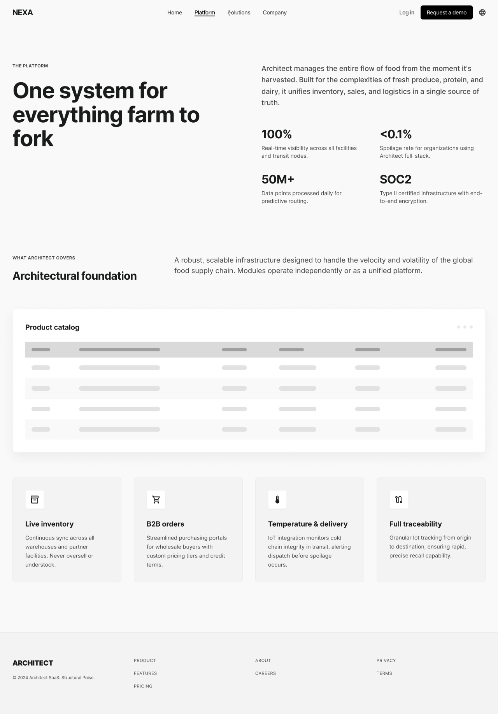
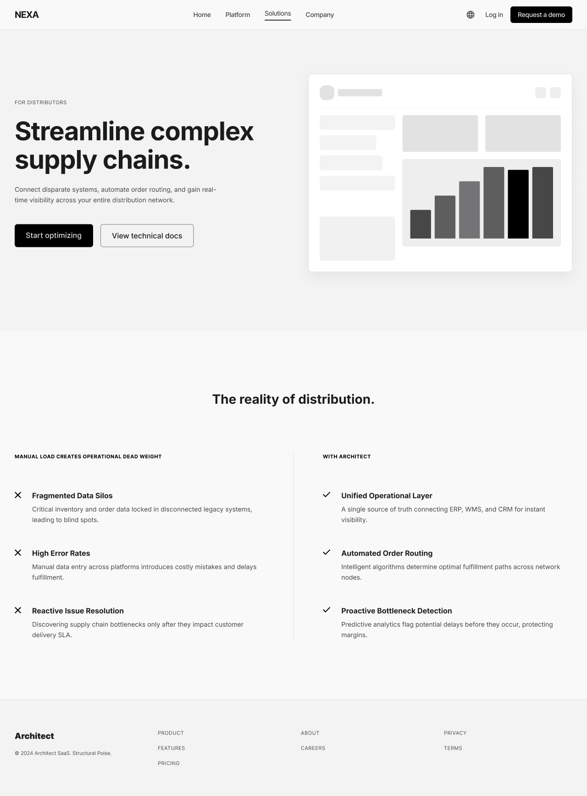
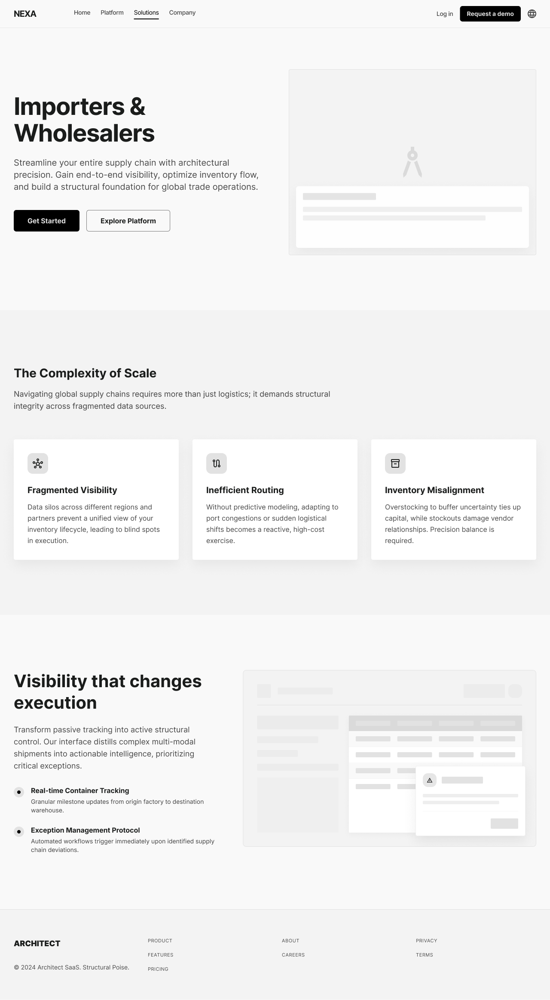
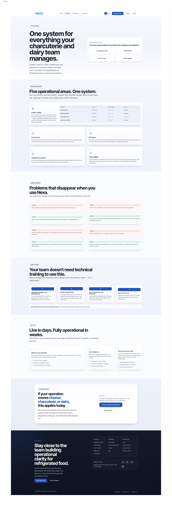
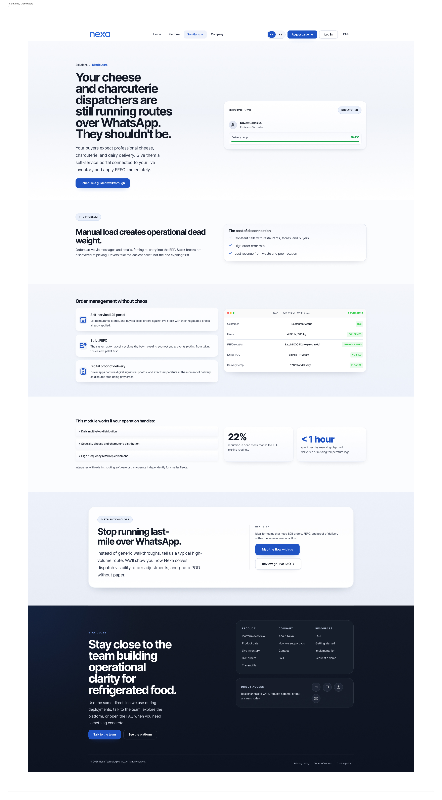
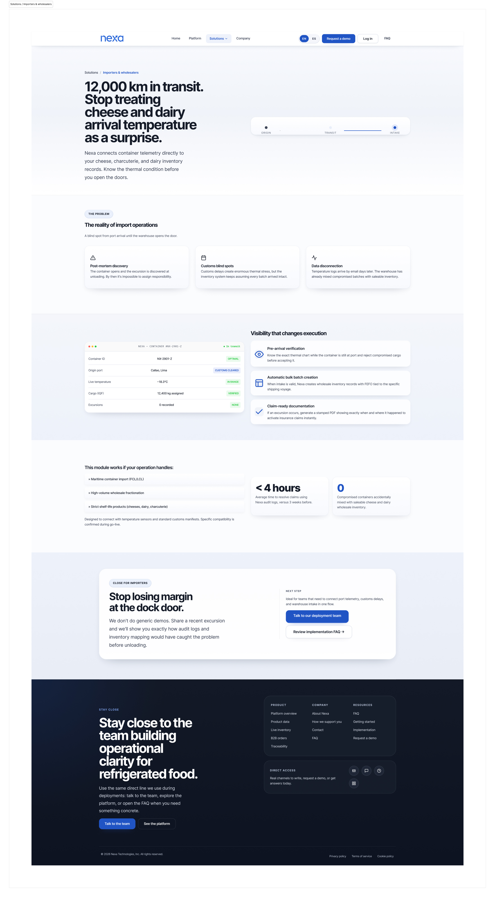
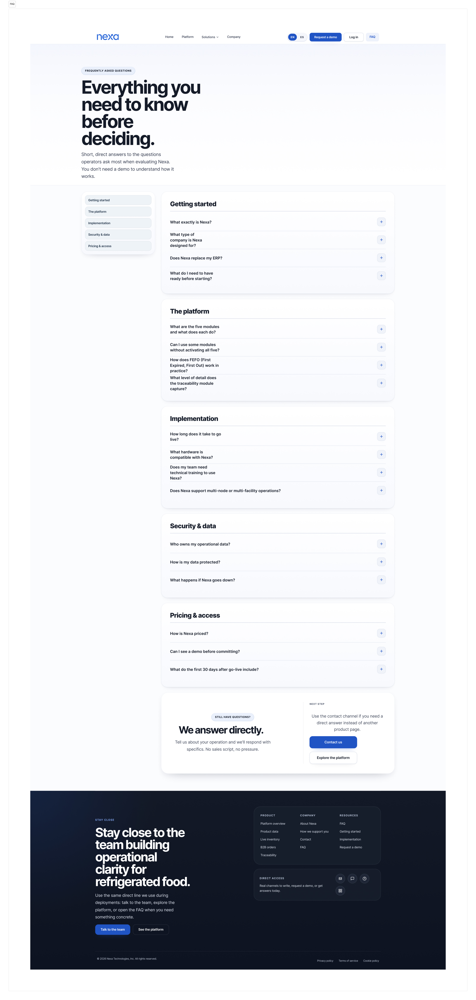

## 4.3. Landing Page UI Design.

La landing page de Nexa es la superficie pública de entrada al modelo de negocio. Su propósito principal es comunicar de forma rápida la propuesta de valor del producto, explicar el problema operativo que resuelve y dirigir a los visitantes hacia una acción concreta: solicitar una demostración, conocer la plataforma o acceder a la Web Application.

El mensaje principal de la landing se centra en hacer visible la operación B2B refrigerada, reduciendo la dependencia de WhatsApp, llamadas, hojas de cálculo y coordinación manual. La comunicación visual refuerza que Nexa no se presenta como un ERP completo, sino como una plataforma SaaS B2B enfocada en conectar pedidos, disponibilidad, coordinación comercial, despacho y seguimiento.

La landing también cumple una función de segmentación comercial. Sus rutas públicas están dirigidas a empresas y visitantes interesados en operaciones de importación, distribución, mayoristas y cámaras frías. Estos visitantes no reemplazan a los segmentos funcionales internos del producto; más bien funcionan como rutas de entrada hacia el ecosistema operativo compuesto por S1, S2 y S3:

1. **S1: Commercial Coordination**, relacionado con la validación comercial, captura de pedidos y coordinación con clientes.
2. **S2: Operations / Account Owner**, relacionado con inventario, despacho, trazabilidad, evidencias y administración de la operación.
3. **S3: B2B Buyer Portal**, relacionado con catálogo, solicitud de pedidos y seguimiento desde el comprador B2B.

La evidencia desplegada de la landing se encuentra en: [https://upc-pre-202610-1asi0730-12242-king.github.io/nexa-website/](https://upc-pre-202610-1asi0730-12242-king.github.io/nexa-website/).

La continuidad entre Landing Page y Web Application se plantea de la siguiente manera:

| Elemento de la landing | Propósito en el sitio público | Continuidad con el producto |
|---|---|---|
| Hero principal y pitch message | Comunicar que Nexa vuelve visible la operación refrigerada y reduce la coordinación dispersa. | Introduce el valor transversal de los flujos de pedido, inventario, despacho y seguimiento. |
| CTA de demostración | Permitir que un visitante comercial solicite conocer la solución antes de contratarla. | Conecta con el flujo comercial previo a la adopción del SaaS. |
| CTA de ingreso | Dirigir a usuarios autorizados hacia el acceso autenticado de la Web Application. | Conecta con el login de usuarios internos y compradores habilitados. |
| Página Platform | Explicar módulos, capacidades y beneficios funcionales de Nexa. | Relaciona la propuesta pública con capacidades como catálogo, pedidos, inventario, despacho y evidencias. |
| Rutas por tipo de operación | Adaptar el mensaje a importadores, mayoristas, distribuidores y operadores de cámaras frías. | Conecta la necesidad comercial de cada visitante con los segmentos funcionales S1, S2 y S3. |
| Secciones de proceso y beneficios | Mostrar cómo cambia la operación antes y después de usar Nexa. | Refuerza los impactos esperados: menor tiempo de registro, menor error operativo y mayor visibilidad del pedido. |
| Sección de contacto | Ofrecer un punto de comunicación para interesados que requieren más información. | Soporta la conversión comercial del visitante hacia una demostración o evaluación del producto. |
| Footer y redes sociales | Dar cierre institucional, navegación secundaria y canales de contacto o presencia digital. | Aumenta confianza y facilita continuidad fuera del recorrido principal de la landing. |

Esta continuidad no implica que la landing replique las pantallas operativas de la Web Application. Su función es presentar el modelo de negocio, orientar al visitante y conducirlo hacia el acceso o contacto correspondiente. Las pantallas autenticadas se documentan posteriormente en las secciones de Web Applications UX/UI Design y Product Implementation.

### 4.3.1. Landing Page Wireframe.

La landing page de Nexa se trabajó primero en **Figma** mediante wireframes de baja fidelidad. En esta etapa se ordenaron contenido, jerarquía de secciones, navegación, rutas por tipo de visitante y puntos de conversión antes de pasar a mockups de mayor detalle.

La revisión se hizo para **Desktop Web Browser** y **Mobile Web Browser**, manteniendo la misma lógica de lectura: entender el problema, reconocer el tipo de operación, revisar la plataforma y encontrar una vía clara de contacto o acceso.

#### A. Desktop Web Browser

*Figura. Wireframe desktop de Home*

> *Nota*. La portada organiza hero, propuesta principal, CTA y primeros bloques de valor para un visitante que llega por primera vez al sitio. Elaboración propia.

*Figura. Wireframe desktop de Platform*

> *Nota*. La página Platform ordena módulos, beneficios funcionales y lectura general de la solución sin entrar todavía a pantallas autenticadas. Elaboración propia.

*Figura. Wireframe desktop de Solutions*

> *Nota*. El hub de soluciones separa rutas públicas para visitantes interesados en distribución, importación, mayoristas y cámaras frías. Elaboración propia.

*Figura. Wireframe desktop de Company*

> *Nota*. La página Company da contexto institucional al proyecto y mantiene una estructura de confianza para el visitante comercial. Elaboración propia.

*Figura. Wireframe desktop de Distribuidores*

> *Nota*. La ruta para distribuidores enfatiza coordinación de pedidos, visibilidad operativa y continuidad de atención. Elaboración propia.

*Figura. Wireframe desktop de Importadores*

> *Nota*. La ruta para importadores y mayoristas prioriza abastecimiento, disponibilidad y lectura de inventario para operaciones B2B. Elaboración propia.

*Figura. Wireframe desktop de FAQ*

> *Nota*. La página FAQ organiza dudas frecuentes sobre acceso, uso, alcance del producto y contacto comercial. Elaboración propia.

#### B. Mobile Web Browser

La versión móvil conserva la misma secuencia pública, pero reduce densidad visual y concentra navegación, lectura de propuesta y CTA en una estructura vertical más compacta.

*Figura. Wireframe mobile de Home*

> *Nota*. La versión móvil concentra hero, navegación compacta, bloques principales y cierre comercial en una lectura continua. Elaboración propia.

### 4.3.2. Landing Page Mock-up.

Una vez validada la estructura, los mockups se desarrollaron en **Figma** para fijar tratamiento visual, jerarquía de botones, ritmo de secciones, color, tipografía e identidad de marca. Las capturas corresponden al recorrido principal en **Desktop Web Browser** y a una muestra de adaptación para **Mobile Web Browser**.

#### A. Desktop Web Browser

*Figura. Mockup desktop de Home*

> *Nota*. Home presenta el pitch principal de Nexa, los CTA de demostración e ingreso, los bloques de capacidades, la segmentación por tipo de operación y el cierre con contacto y redes sociales. Elaboración propia.

*Figura. Mockup desktop de Platform*

> *Nota*. Platform muestra la propuesta funcional del producto mediante módulos, beneficios operativos y lectura de plataforma. Elaboración propia.

*Figura. Mockup desktop para operadores de cámaras frías*

> *Nota*. La variante para cámaras frías comunica control, almacenamiento y trazabilidad de productos sensibles. Elaboración propia.

*Figura. Mockup desktop de Company*

> *Nota*. Company refuerza el contexto del proyecto y la confianza necesaria antes de iniciar contacto comercial. Elaboración propia.

*Figura. Mockup desktop para distribuidores*

> *Nota*. La ruta para distribuidores enfatiza pedido, coordinación y continuidad operativa. Elaboración propia.

*Figura. Mockup desktop para importadores y mayoristas*

> *Nota*. La ruta para importadores y mayoristas adapta la propuesta a operaciones con dependencia de abastecimiento y stock. Elaboración propia.

*Figura. Mockup desktop de FAQ*

> *Nota*. FAQ reduce fricción previa al contacto mediante respuestas breves y navegación directa. Elaboración propia.

#### B. Mobile Web Browser

La adaptación móvil mantiene el mismo lenguaje visual del sitio público y prioriza lectura vertical, CTA visible y bloques más compactos para consulta desde teléfono.

*Figura. Mockup mobile de Home*

> *Nota*. > *Nota*. La captura móvil valida que el pitch, la navegación, los CTA, las secciones principales, el contacto y el cierre institucional se mantengan accesibles en una experiencia responsiva. Elaboración propia.
