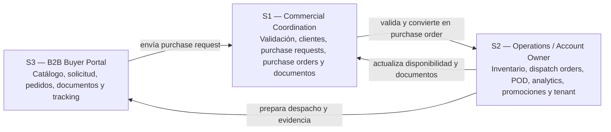
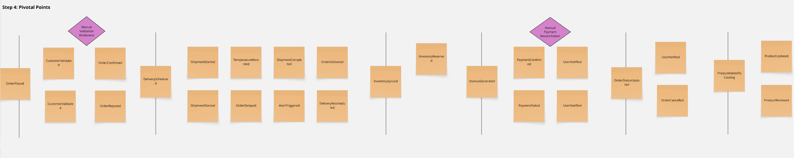
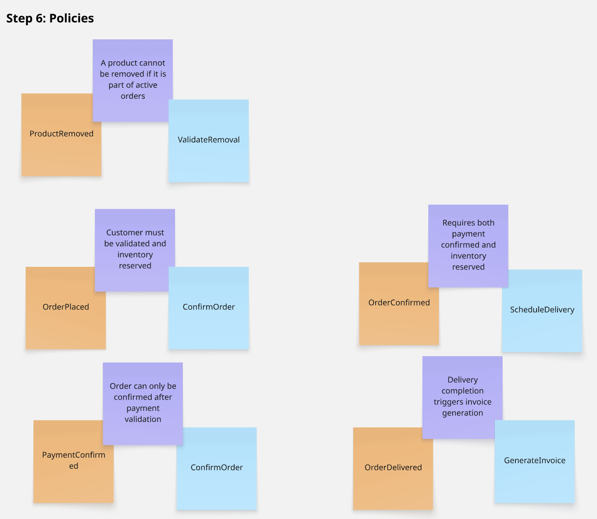
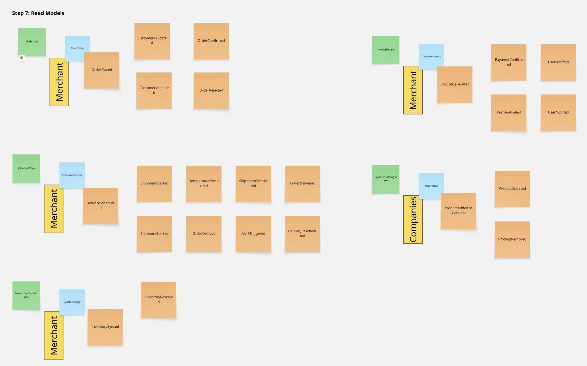
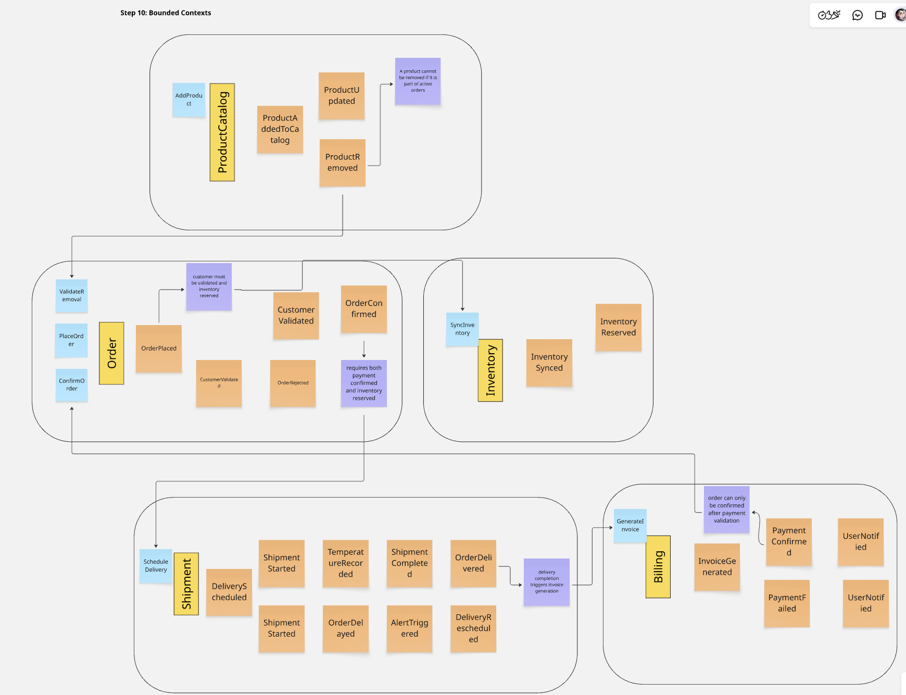
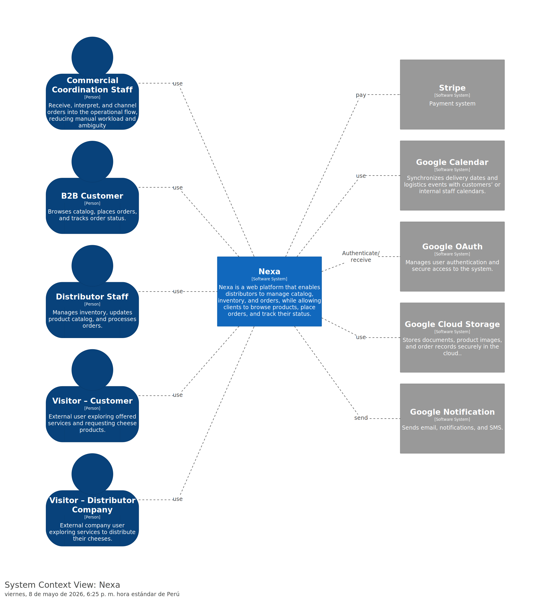
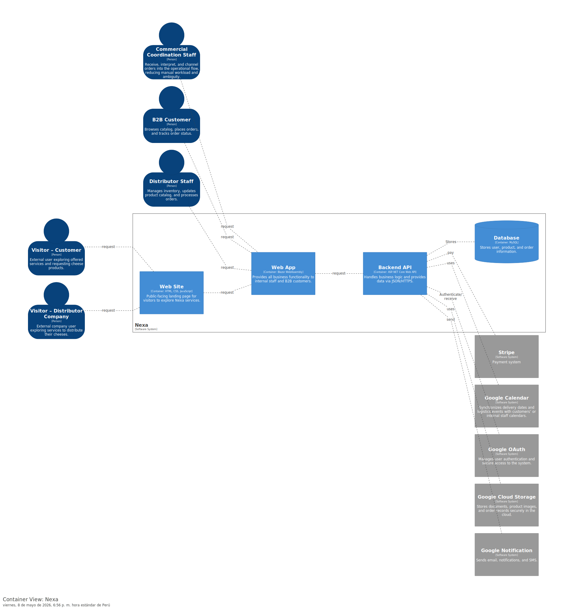
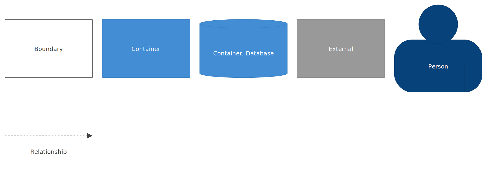

## 4.6. Domain-Driven Software Architecture

> **Nota de alcance:** Las secciones 4.6, 4.7 y 4.8 documentan la arquitectura objetivo de Nexa. En el corte TB1, la Web Application opera con Fake API mediante JSON Server para simular integración. El backend real, la base de datos normalizada y las integraciones externas se documentan como diseño arquitectónico objetivo, no como implementación desplegada. Esta distinción evita confundir modelado de dominio con evidencia productiva.

La arquitectura de Nexa se apoya en **Domain-Driven Design** para ordenar el dominio antes de bajar a clases, tablas, endpoints o detalles de implementación. El sistema no se modela como una colección de pantallas, sino como una plataforma SaaS B2B para operaciones de cadena de frío que conecta tres segmentos complementarios:

- **S1 — Commercial Coordination:** valida solicitudes, clientes, condiciones comerciales, documentos y convierte solicitudes en purchase orders.
- **S2 — Operations / Account Owner:** controla inventario, lotes, FEFO, despacho, evidencias, promociones, portales externos y administración de empresa/tenant.
- **S3 — B2B Buyer Portal:** consulta catálogo, arma solicitudes, revisa pedidos, accede a documentos visibles y sigue el estado del despacho.

El flujo principal que guía la arquitectura es: **S3 solicita**, **S1 valida y convierte**, **S2 ejecuta inventario y despacho**, y **S3 consulta tracking y documentos**. Por ello, los bounded contexts se organizan por capacidades de negocio y no por componentes visuales de frontend.

No se crea un segmento Admin separado. La administración de empresa, usuarios, accesos, configuración, tenant y suscripción forma parte de **S2 — Operations / Account Owner**.

### 4.6.1. Design-Level EventStorming

El Design-Level EventStorming permitió pasar de una lectura general del problema a una estructura de dominio más precisa. Las primeras etapas de exploración del flujo general se documentan en el Capítulo II como parte del Big Picture EventStorming. En esta sección se consolida el refinamiento técnico posterior: puntos pivote, commands, policies, read models y bounded contexts.

El objetivo principal fue identificar qué eventos del negocio ocurren, qué comandos los disparan, qué reglas los condicionan, qué información necesita cada segmento y qué límites funcionales deben mantenerse separados para evitar un modelo monolítico confuso.

Las capturas siguientes corresponden al desarrollo técnico del workshop. Como respaldo adicional se mantiene el board de Miro: [Design-Level EventStorming en Miro](https://miro.com/welcomeonboard/OC95SW9ySW9zY3Q5QURlWWFpTlN4NmVuY2xHWVRYdTBkd3hZR2FHcEZ1cDRBYm5SY1NYMkpvNFdYSmc1T1hLZ2lsQko3Z2RKUDdlbWF6ZmRRU21EalNzSEZqc2NKT2l6MTc2TXBFbjFUTTM2L3phOTVDWktNeTVnY1hVZGVEZjZBd044SHFHaVlWYWk0d3NxeHNmeG9BPT0hdjE=?share_link_id=419986690457).

*Design-Level EventStorming — Step 4: Pivotal Points*

La cuarta vista resaltó los puntos de decisión del proceso. Los momentos más relevantes fueron la entrada de una solicitud, la revisión comercial, la verificación de disponibilidad, la conversión a pedido confirmado, la preparación del despacho y el cierre con evidencia. Estos puntos determinan si el flujo continúa, se observa, se bloquea o requiere intervención de otro segmento.

*Design-Level EventStorming — Step 5: Commands*

Con el flujo más claro, el workshop pasó a las acciones que disparan eventos de dominio. Aparecen comandos como enviar solicitud, validar cliente, revisar crédito, convertir solicitud en purchase order, reservar stock, preparar dispatch order, registrar evidencia POD, publicar documentos y actualizar tracking.

*Design-Level EventStorming — Step 6: Policies*

Las políticas permitieron fijar reglas de negocio que no dependen de una pantalla específica. Entre ellas se consideran validaciones de cliente, crédito, documentos requeridos, disponibilidad de stock, prioridad FEFO, visibilidad de catálogo, restricciones por tenant y publicación de documentos visibles para el comprador.

*Design-Level EventStorming — Step 7: Read Models*

La séptima vista se concentró en la información que necesita cada segmento para operar. S1 requiere bandejas de solicitudes, clientes, purchase orders y documentos comerciales. S2 requiere inventario, lotes, dispatch orders, POD, analytics y company administration. S3 requiere catálogo, request builder, mis solicitudes, mis pedidos, documentos visibles y tracking.

El board exportado no conserva una captura separada del paso 8. La consolidación visible continúa en las vistas 9 y 10.

*Design-Level EventStorming — Step 9: Consolidated Flow by Context*

La novena vista reorganiza el flujo en bloques más estables. En esta etapa se identificó que el dominio debía separarse por capacidades de negocio: acceso, empresa/tenant, catálogo, solicitudes, órdenes, inventario, despacho, documentos, promociones y analítica.

*Design-Level EventStorming — Step 10: Bounded Contexts*

La última captura resume los bounded contexts resultantes del workshop. Esa vista funciona como evidencia del proceso, pero el modelo final del reporte se refinó para alinearse con los segmentos definitivos S1, S2 y S3. Por ello, la arquitectura final no se limita a bloques genéricos como Product Catalog, Order, Inventory, Shipment y Billing; se reorganiza alrededor del flujo real de Nexa.

#### Bounded contexts consolidados

| Bounded context | Responsabilidad principal | Segmentos conectados | Tipo de subdominio |
|---|---|---|---|
| Identity & Access | Login, usuarios, roles, permisos, scopes, sesiones y acceso por segmento | S1, S2, S3 | Supporting |
| Company Administration & Subscriptions | Empresa contratante, tenant, accesos del equipo, configuración de cuenta y suscripción | S2 | Supporting |
| Product Catalog | Productos, categorías, condiciones de conservación, visibilidad, precios referenciales y catálogo visible | S1, S2, S3 | Core |
| Purchase Requests & Commercial Validation | Solicitudes recibidas desde Buyer Portal o entrada manual, validación de cliente, crédito, observaciones y ajustes | S3, S1 | Core |
| Purchase Orders | Conversión de solicitud validada en pedido confirmado, detalle de pedido, estado comercial y trazabilidad del origen | S1, S2, S3 | Core |
| Inventory Control | Stock real, lotes, FEFO, reservas, disponibilidad, temperaturas y alertas operativas | S2, S1 | Core |
| Dispatch Orders & Proof of Delivery | Preparación de despacho, ruta, responsable, estado, incidencias, tracking y evidencia POD | S2, S3 | Core |
| Business Documents | Factura referencial, guía, XML, CDR, POD y tareas documentales vinculadas a portales externos | S1, S2, S3 | Core / Supporting |
| Promotions & Buyer Engagement | Promociones, premium catalog, comunicación comercial y contenidos visibles para compradores | S2, S3 | Supporting |
| Operational Analytics | Indicadores de solicitudes, pedidos, inventario, despacho, documentos e incidencias | S2 | Supporting |

#### Aggregates, Commands, Events and Queries

| Bounded context | Aggregate roots principales | Commands | Domain events | Queries / Read models |
|---|---|---|---|---|
| Identity & Access | `User`, `Role`, `UserSession`, `AccessScope` | `AuthenticateUser`, `RecoverAccess`, `AssignRole`, `BlockUserAccess`, `ValidateAccessScope` | `UserAuthenticated`, `AccessRecovered`, `RoleAssigned`, `UserAccessBlocked`, `UnauthorizedAccessAttempted` | `UserProfileView`, `AuthorizedModulesView`, `SessionStatusView` |
| Company Administration & Subscriptions | `CompanyTenant`, `CompanyMember`, `SubscriptionPlan`, `TenantSettings` | `ConfigureCompany`, `InviteCompanyMember`, `UpdateTenantSettings`, `ChangeSubscriptionPlan` | `CompanyConfigured`, `MemberInvited`, `TenantSettingsUpdated`, `SubscriptionPlanChanged` | `CompanyAdministrationView`, `TenantMembersView`, `SubscriptionStatusView` |
| Product Catalog | `Product`, `Category`, `ProductVisibility`, `PriceReference` | `RegisterProduct`, `UpdateProduct`, `PublishProduct`, `ConfigureBuyerVisibility`, `UpdatePriceReference` | `ProductRegistered`, `ProductUpdated`, `ProductPublished`, `BuyerVisibilityConfigured`, `PriceReferenceUpdated` | `InternalProductCatalogView`, `BuyerVisibleCatalogView`, `ProductDetailView` |
| Purchase Requests & Commercial Validation | `PurchaseRequest`, `RequestItem`, `RequestComment`, `CommercialValidation` | `SubmitPurchaseRequest`, `CreateManualRequest`, `ReviewClientCondition`, `RequestAdjustment`, `ApprovePurchaseRequest`, `RejectPurchaseRequest` | `PurchaseRequestSubmitted`, `ManualRequestCreated`, `ClientConditionReviewed`, `PurchaseRequestNeedsAdjustment`, `PurchaseRequestApproved`, `PurchaseRequestRejected` | `CommercialRequestsInbox`, `PurchaseRequestDetailView`, `BuyerRequestsView` |
| Purchase Orders | `PurchaseOrder`, `PurchaseOrderItem`, `OrderStatusHistory` | `ConvertRequestToOrder`, `ConfirmPurchaseOrder`, `UpdateOrderStatus`, `CancelPurchaseOrder`, `AttachOrderObservation` | `PurchaseOrderCreated`, `PurchaseOrderConfirmed`, `OrderStatusUpdated`, `PurchaseOrderCancelled`, `OrderObservationAttached` | `CommercialOrdersView`, `BuyerOrdersView`, `PurchaseOrderDetailView` |
| Inventory Control | `InventoryLot`, `Warehouse`, `StockReservation`, `StockMovement` | `RegisterInventoryLot`, `ReserveStock`, `ReleaseStockReservation`, `RegisterStockMovement`, `FlagExpiringLot` | `InventoryLotRegistered`, `StockReserved`, `StockReservationReleased`, `StockMovementRegistered`, `ExpiringLotFlagged` | `InventoryControlView`, `InventoryLotsView`, `LotDetailView`, `AvailabilityView` |
| Dispatch Orders & Proof of Delivery | `DispatchOrder`, `DispatchRoute`, `DispatchIncident`, `PodEvidence`, `TrackingEvent` | `CreateDispatchOrder`, `AssignDispatchResponsible`, `UpdateDispatchStatus`, `RegisterDispatchIncident`, `UploadPodEvidence`, `CloseDispatchOrder` | `DispatchOrderCreated`, `DispatchResponsibleAssigned`, `DispatchStatusUpdated`, `DispatchIncidentRegistered`, `PodEvidenceUploaded`, `DispatchOrderClosed` | `DispatchBoardView`, `DispatchDetailView`, `ProofOfDeliveryView`, `BuyerTrackingView` |
| Business Documents | `BusinessDocument`, `DocumentRequirement`, `ExternalPortalTask` | `RegisterBusinessDocument`, `MarkDocumentAsVisible`, `ValidateDocumentRequirement`, `CreateExternalPortalTask`, `ResolveExternalPortalTask` | `BusinessDocumentRegistered`, `DocumentPublishedToBuyer`, `DocumentRequirementValidated`, `ExternalPortalTaskCreated`, `ExternalPortalTaskResolved` | `CommercialDocumentsView`, `OperationsDocumentsView`, `BuyerDocumentsView` |
| Promotions & Buyer Engagement | `Promotion`, `BuyerSegment`, `PremiumCatalogPreview` | `CreatePromotion`, `PublishPromotion`, `AssignPromotionToBuyerSegment`, `UpdatePremiumCatalogPreview` | `PromotionCreated`, `PromotionPublished`, `PromotionAssignedToBuyerSegment`, `PremiumCatalogPreviewUpdated` | `PromotionsManagementView`, `BuyerPremiumPreviewView`, `VisibleOffersView` |
| Operational Analytics | `AnalyticsSnapshot`, `KpiDefinition`, `OperationalReport` | `GenerateAnalyticsSnapshot`, `RefreshOperationalReport`, `CalculateKpi` | `AnalyticsSnapshotGenerated`, `OperationalReportRefreshed`, `KpiCalculated` | `CommercialDashboardView`, `OperationsDashboardView`, `OperationalAnalyticsView` |

Esta separación evita que un único módulo de “orders” concentre todo el dominio. En Nexa, una **purchase request** no es lo mismo que una **purchase order**; inventario no es catálogo; dispatch no es solo un estado del pedido; y business documents tienen reglas propias de visibilidad, validación y soporte operativo.

### 4.6.2. Software Architecture Context Diagram

Para las vistas C4 se utiliza Structurizr como herramienta de modelado. La vista de contexto ubica a Nexa como sistema central frente a sus usuarios principales y sistemas externos considerados dentro de la arquitectura objetivo.

El contexto del sistema debe mostrar cinco tipos de actores o sistemas alrededor de Nexa:

| Elemento externo | Tipo | Relación con Nexa | Alcance |
|---|---|---|---|
| Public Visitor | Persona | Explora la Landing Page, revisa propuesta de valor y solicita una demostración | Landing Page |
| S1 — Commercial Coordination | Persona / usuario interno | Valida solicitudes, clientes, purchase orders y documentos comerciales | Web Application interna |
| S2 — Operations / Account Owner | Persona / usuario interno | Controla inventario, despacho, evidencias, analytics, tenant y configuración de empresa | Web Application interna |
| S3 — B2B Buyer Portal | Persona / comprador externo habilitado | Consulta catálogo, envía solicitudes, revisa pedidos, documentos y tracking | Buyer Portal |
| External Services | Sistemas externos | Autenticación, notificaciones, almacenamiento documental, calendario operativo y pagos/suscripción | Arquitectura objetivo |

El diagrama de contexto muestra que Nexa no atiende a un único usuario. La plataforma conecta visitantes públicos, usuarios internos de la empresa contratante y compradores B2B externos dentro de un mismo ecosistema SaaS.

*Diagrama de Contexto del Sistema Nexa (C4 — Nivel 1)*

> *Nota:* Elaboración propia mediante Structurizr. La figura debe verificarse antes de la entrega final para confirmar que los actores se encuentren actualizados como S1, S2 y S3. Si la imagen todavía muestra actores genéricos o nombres anteriores, debe regenerarse desde Structurizr y reemplazarse en esta ruta.

*Leyenda del diagrama C4 de contexto*

> *Nota:* Elaboración propia mediante Structurizr.

El contexto deja ver que el sistema combina una experiencia pública de descubrimiento con una experiencia autenticada operacional. Los visitantes interactúan con la Landing Page; S1 y S2 operan dentro de la consola interna; y S3 utiliza el Buyer Portal para reducir dependencia de WhatsApp, llamadas o coordinación manual. Las integraciones externas se consideran apoyo del ecosistema, no el núcleo del dominio.

### 4.6.3. Software Architecture Container Diagrams

La vista de contenedores separa el sitio público, la Web Application autenticada, la Fake API usada en TB1 y la plataforma/backend objetivo. Esta separación permite distinguir la evidencia actual de implementación frente a la arquitectura final esperada.

| Container | Tecnología | Responsabilidad | Estado TB1 |
|---|---|---|---|
| Public Website | HTML, CSS y JavaScript | Presentar Landing Page, páginas comerciales, propuesta de valor, FAQ y CTA hacia demo o login | Implementado como sitio público |
| Web Application SPA | Vue 3, Vite, PrimeVue, PrimeFlex, PrimeIcons, Vue Router, Vue-i18n, Axios y Pinia | Ejecutar la experiencia autenticada para S1, S2 y S3 | Implementado como frontend con Fake API |
| Fake RESTful API | JSON Server | Simular recursos y respuestas para la Web Application durante TB1 | Implementado como soporte de demo |
| Backend API | ASP.NET Core Web API | Exponer lógica de negocio, endpoints RESTful, validaciones, persistencia e integración con servicios externos | Arquitectura objetivo |
| Database | MySQL | Persistir usuarios, empresa, catálogo, solicitudes, órdenes, inventario, despacho, documentos y reportes | Arquitectura objetivo |
| External Services | OAuth, notificaciones, almacenamiento documental, calendario y pagos/suscripción | Soporte de autenticación, comunicación, documentos, scheduling y billing | Arquitectura objetivo |

*Diagrama de Contenedores del Sistema Nexa (C4 — Nivel 2)*

> *Nota:* Elaboración propia mediante Structurizr. La figura debe verificarse antes de la entrega final para confirmar que represente la Web Application como Vue 3 SPA y que incluya Fake API / JSON Server como container de simulación usado en TB1. Si la imagen todavía muestra `Blazor WebAssembly` o no distingue Fake API, debe regenerarse desde Structurizr.

*Leyenda del diagrama C4 de contenedores*

> *Nota:* Elaboración propia mediante Structurizr.

En esta arquitectura, la Landing Page no contiene lógica de operación interna. Su función es comunicar valor y dirigir al visitante hacia demo o login. La Web Application SPA concentra la experiencia de S1, S2 y S3. Durante TB1, esta SPA consume Fake API mediante JSON Server. En la arquitectura objetivo, la SPA deberá consumir un Backend API en ASP.NET Core conectado a MySQL y a servicios externos.

> **Nota de alcance TB1:** En TB1, la entrega evidencia una Web Application frontend integrada con Fake RESTful API. El Backend API en ASP.NET Core, la base de datos MySQL y las integraciones externas se mantienen como arquitectura objetivo y deberán evidenciarse en iteraciones posteriores cuando realmente se implementen.

### 4.6.4. Software Architecture Components Diagrams

La vista de componentes baja un nivel más y muestra cómo se distribuyen las responsabilidades dentro de los containers principales. Para Nexa, la lectura correcta debe diferenciar componentes del frontend, componentes de simulación y componentes objetivo del backend.

La Web Application SPA se organiza en módulos de presentación, servicios de aplicación frontend, rutas, guards, adaptadores HTTP, stores y componentes compartidos. Estos módulos deben alinearse con los bounded contexts sin asumir que cada vista frontend es un bounded context independiente.

| Container | Componentes principales | Responsabilidad |
|---|---|---|
| Web Application SPA | IAM routes and guards | Login, recuperación, bloqueo, forbidden state y control de acceso por scope |
| Web Application SPA | Commercial workspace | Dashboard comercial, purchase requests, purchase orders, manual order entry, client accounts y business documents para S1 |
| Web Application SPA | Operations workspace | Operations dashboard, inventory control, inventory lots, dispatch orders, proof of delivery, analytics, promotions, customer portals y company administration para S2 |
| Web Application SPA | Buyer Portal workspace | Portal home, product catalog, product detail, request builder, my requests, my orders, business documents, premium y profile para S3 |
| Web Application SPA | Shared UI and layout | Layouts, sidebar, topbar, cards, tables, forms, estados visuales y componentes reutilizables |
| Web Application SPA | HTTP adapters and stores | Axios clients, repositories frontend, stores y transformación de datos recibidos del Fake API |
| Fake RESTful API | `db.json` resources | Datos simulados de usuarios, productos, solicitudes, órdenes, inventario, despacho y documentos |
| Fake RESTful API | `routes.json` mappings | Mapeo de rutas simuladas para la demo TB1 |
| Backend API objetivo | Application services | Orquestación de casos de uso por bounded context |
| Backend API objetivo | Domain model | Aggregates, entities, value objects, domain services y domain events |
| Backend API objetivo | Infrastructure adapters | Repositorios, persistencia, integraciones externas, archivos, notificaciones y seguridad |

*Diagrama de Componentes del Sistema Nexa (C4 — Nivel 3)*

> *Nota:* Elaboración propia. La figura representa una aproximación de arquitectura objetivo y debe actualizarse para reflejar la estructura actual: Vue 3 SPA, Fake API, bounded contexts finales y segmentos S1, S2 y S3. Si la imagen todavía muestra componentes antiguos como `Blazor`, `Payment UI` o agrupaciones genéricas no alineadas al flujo de Nexa, debe regenerarse antes de la entrega correspondiente.

#### Lectura de componentes por bounded context

| Bounded context | Componentes esperados en frontend | Componentes esperados en backend objetivo |
|---|---|---|
| Identity & Access | Login view, recover view, forbidden view, guards, profile view | Authentication service, authorization service, user repository, session repository |
| Company Administration & Subscriptions | Company administration view, tenant settings forms, member management UI | Company service, subscription service, tenant settings repository |
| Product Catalog | Internal product catalog, buyer product catalog, product detail | Product application service, catalog repository, visibility rules |
| Purchase Requests & Commercial Validation | Commercial purchase requests inbox, request detail, buyer requests | Request service, commercial validation service, request repository |
| Purchase Orders | Commercial orders, buyer orders, order detail, success state | Purchase order service, order repository, order status policy |
| Inventory Control | Inventory control, inventory lots, lot detail | Inventory service, stock reservation service, inventory repository |
| Dispatch Orders & Proof of Delivery | Dispatch board, dispatch detail, proof of delivery views | Dispatch service, tracking service, POD evidence service |
| Business Documents | Commercial documents, operations documents, buyer documents | Document service, document visibility policy, external portal task service |
| Promotions & Buyer Engagement | Promotions management, premium preview | Promotion service, buyer engagement service |
| Operational Analytics | Commercial dashboard, operations dashboard, operational analytics | Analytics service, KPI calculator, read model generator |

Esta vista evita una correspondencia literal entre cada pantalla y cada bounded context. Por ejemplo, un dashboard puede leer datos de varios contexts mediante read models, pero no por eso se convierte en un bounded context independiente. Del mismo modo, Business Documents puede ser visible para S1, S2 y S3, pero sus reglas de visibilidad y validación deben permanecer dentro de su propio límite funcional.

#### Relación entre C4, DDD y secciones posteriores

| Elemento | Sección donde se profundiza | Función |
|---|---|---|
| Bounded contexts | 4.6 | Definir límites de negocio y responsabilidades |
| Aggregates, commands, events and queries | 4.6 | Explicar comportamiento del dominio |
| Class diagrams | 4.7 | Bajar bounded contexts a clases, entidades, value objects, servicios y repositorios |
| Database diagrams | 4.8 | Traducir el modelo objetivo a estructuras relacionales |
| Software Configuration Management | 5.1 | Evidenciar repositorios, branching, convenciones y configuración técnica |
